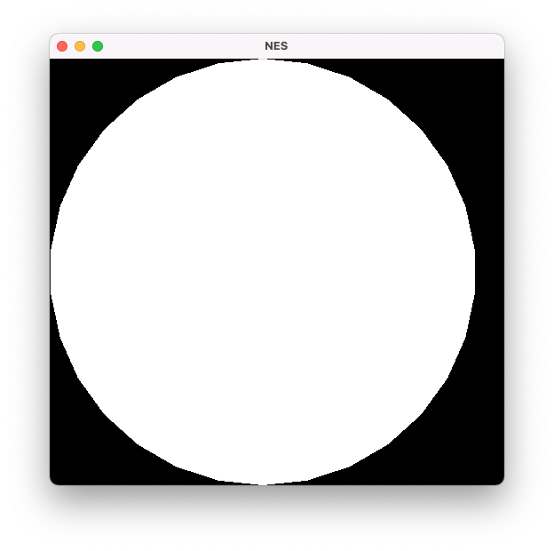
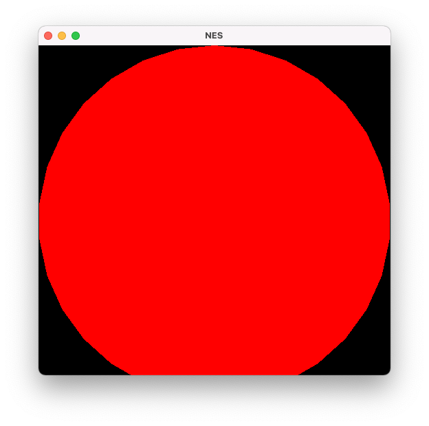

# Quick Start

```shell
git clone git@github.com:sujb0217/TinyNES.git

cd TinyNES

mkdir build

export LD_LIBRARY_PATH=<sfml-install-path>/lib

make

./run ./games/Super_mario_brothers.nes
```

### Playing:


# Realization of NES's CPU Simulator with C++

## DAY 01

**Simulate 6502 CPU, MainBus and Memory RAM to realize CPU reading and writing data and fetching instructions from memory.**

## DAY 02

**Implemented decoding and execution of instructions by 6502 CPU.**

## DAY 03

**Test our previous code for bugs and if the CPU would work properly.**

**Part of code is test code which will be commented later.**

NES software writing example, located in the `example/nes` directory, mainly including files:

- `nes.cfg`: Specified the link method
- `example.asm`: Implement a simple "4+2" operation

### 1. Download the compiler

- **MacOS:** `brew install cc65`
- [Linux](https://debian.trikaliotis.net/cc65/)
- [Windows](https://sourceforge.net/projects/cc65/files/cc65-snapshot-win32.zip)

### 2. Compile & Link

```shell
ca65 example.asm -o example.o 
ld65 -C nes.cfg example.o -o example.nes
```

### 3. Check `example.nes` file by binary code

Install `hexdump for vscode` under vscode, and open it with the binary reader, you will see:

- 0x0000: header of `.nes`

- 0x0010:

    ```assembly
    A9 04 ; LDA #$4
    69 02 ; ADC #$2
    ```

- 0x8000: Interrupt vector table saves the target address `0x8000`, because we specified `PRG: start = $8000` in **example/nes/nes.cfg** , which is the first address of the `main()` in our assembly code.

    ```assembly
    00000000: 4E 45 53 1A 02 00 00 00 00 00 00 00 00 00 00 00    NES.............
    00000010: A9 04 69 02 00 00 00 00 00 00 00 00 00 00 00 00
    ...
    ...
    00008000: 00 00 00 00 00 00 00 00 00 00 00 80 00 80 00 80
    ```

### 4. Compile and Execute the simulator

```shell
make
./run
```

### 5. Check the result

The result is as follows:

```shell
Reading ROM from path: ./example/example.nes
Reading header, it dictates:
16KB PRG-ROM Banks: 2
8KB CHR-ROM Banks: 0
ROM is NTSC compatible.
a9 4 69 2 0 0 0 0 0 0 0 0 0 0 0 0 0 0 0 0
Cartridge with CHR-RAM.
MainBus Read a Byte: 0
MainBus Read a Byte: 80
[+]After reset, PC locates: 0x8000
MainBus Read a Byte: a9
MainBus Read a Byte: 4
MainBus Read a Byte: 69
MainBus Read a Byte: 2
[+]After executing "4+2" operation, the value of ACC is: 6
```

## DAY 04

### 1. Mapper

> 预留给游戏卡的地址空间是有限的，游戏卡的程序内存（Program Memory）被限制在 32 KB，角色内存（Character Memory）被限制在 8 KB。为了突破这种限制，人们发明了内存映射器（Mapper）。
>
> 内存映射器是游戏卡中的一个硬件，具有存储体空间切换（Bank Switching）的功能，以将新的程序或角色内存引入到可寻址的内存空间。程序可以通过向指向内存映射器的特定的地址写入数据来控制存储体空间的切换。  
>
> 不同的游戏卡实现了不同的存储体空间切换方案，所以会有十几种不同的内存映射器。既然模拟器要模拟 NES 的硬件，也就必须能够模拟游戏卡的 内存映射器。尽管如此，实际上 90% 的 FC 游戏使用的都是六种最常见的内存映射器中的一种。

***Reference:*** [我用 Go 语言做了一个红白机模拟器](https://studygolang.com/articles/03157)

Therefore, there are many different implementations of Mapper. Therefore, when using different cartridges, the Mapper type used by the cartridge should be identified.

On day 3, we simply parsed the .NES file, refer to [wiki](https://wiki.nesdev.com/w/index.php/INES), its format can be expressed as follows,

```shell
0-3: Constant $4E $45 $53 $1A ("NES" followed by MS-DOS end-of-file)
4: Size of PRG ROM in 16 KB units
5: Size of CHR ROM in 8 KB units (Value 0 means the board uses CHR RAM)
6: Flags 6 - Mapper, mirroring, battery, trainer
7: Flags 7 - Mapper, VS/Playchoice, NES 2.0
8: Flags 8 - PRG-RAM size (rarely used extension)
9: Flags 9 - TV system (rarely used extension)
10: Flags 10 - TV system, PRG-RAM presence (unofficial, rarely used extension)
11-15: Unused padding (should be filled with zero, but some rippers put their name across bytes 7-15)

The specific meaning of Flag6 is as follows:
76543210
||||||||
|||||||+-  镜像位: 0: 水平 1: 垂直。游戏是横版还是纵版
||||||+--  1: 卡带包含电池供电的RAM($6000-7FFF)或其他持久性存储介质
|||||+---  1: trainer 标志位，可不管
||||+----  1: 忽略镜像控制或上述的镜像位；而是提供四屏VRAM。由于 NES 的显存只有2kb, 只能支持2屏幕. 如果卡带自带了额外的显存就可以利用4屏幕了
++++-----  Mapper号的低四位

The specific meaning of Flag7 is as follows:
76543210
||||||||
|||||||+-  VS Unisystem
||||||+--  PlayChoice-10 (8KB of Hint Screen data stored after CHR data)
||||++---  If equal to 2, flags 8-15 are in NES 2.0 format
++++-----  Mapper编号的高四位
```

The high four bits of `Flag6` record the low four bits of the mapper number, and the high four bits of `Flag7` record the high four bits of the mapper number.

### 2. Emulator

Add 'Emulator' to integrate various components

### 3. Compile & Run

```shell
make clean
./run ./games/Super_mario_brothers.nes
```

**But the result is:**

```shell
[1]    segmentation fault  ./run ./games/Super_mario_brothers.nes
```

😅 Emmm...

**Last test caused the segmentation fault !!!**
So **DO NOT FORGET TO COMMENT THE PREVIOUS TEST CODE !!!**

**For Example**
MainBus.cpp:20:

```cpp
// For Test
if (addr >= 0x8000) {
  const Data value = cartridge.getROM()[addr - 0x8000];
  std::cout << "MainBus Read a Byte: " << std::hex << static_cast<int> (value) << std::endl;
  return value;
}
```

and CPU.hpp:29

```cpp
// OPEN THE API ONLY FOR TEST!
Data get_acc() {
  return r_acc;
}
```

## DAY 05

### 1. SFML多媒体库配置和使用

根据自己所使用的操作系统，在 [SFML官方文档](https://www.sfml-dev.org/tutorials/2.5/) 找到对应的配置方式。

建议最好使用官方已经编译好的 SDK，替换到系统的默认动态链接库目录或任意目录下（此时编译链接时需要制定对应的头文件和库文件目录）

例如，在 macOS 下通过 `brew install sfml` 安装 SFML SDK后，将在 `/usr/local/Cellar/sfml/2.5.1` （或 `/usr/local/Cellar/sfml/2.5.1_1` 等）目录下保存头文件和库文件。需要在 makefile 下指定 `CFLAGS` 和 `LDFLAGS` 。

```shell
SFML_INC = /usr/local/Cellar/sfml/2.5.1_1/include

CFLAGS = -g -Wall -I${INC} -I${SFML_INC} -std=c++11
# 不仅要指定目录，还要指定对应链接的库，不然就是 undefined reference 
LDFLAGS = -L/usr/local/Cellar/sfml/2.5.1/lib -lsfml-graphics -lsfml-window -lsfml-system
```

**White Circe:**


**Red Circe:**


### 2. PPU总线（Picture Bus）以及虚拟屏幕（Virtual Screen）的实现

在使用 SFML 库创建一个 windows 后，内容的填充使用 VirtualScreen 类来实现。PictureBus 类似于我们之前实现的 MainBus，不过 PictureBus 是用来连接PPU（Picture Processing Unit,类比于现在的显卡）和 vdeio 相关的存储的。

## DAY N

### Add Controller and read user's input

### Conclusion

**Copy more code and feel more confused...**

Struggled and Debugged so many days for the faults in Emulator.cpp: run() because I didn't learn about it before, and in CPU.cpp because of my careless...

**I suppose, therefore, learn more and understand the essence of the problems are necessary!**

## It's truly a good project for me but not a happy process ;P
